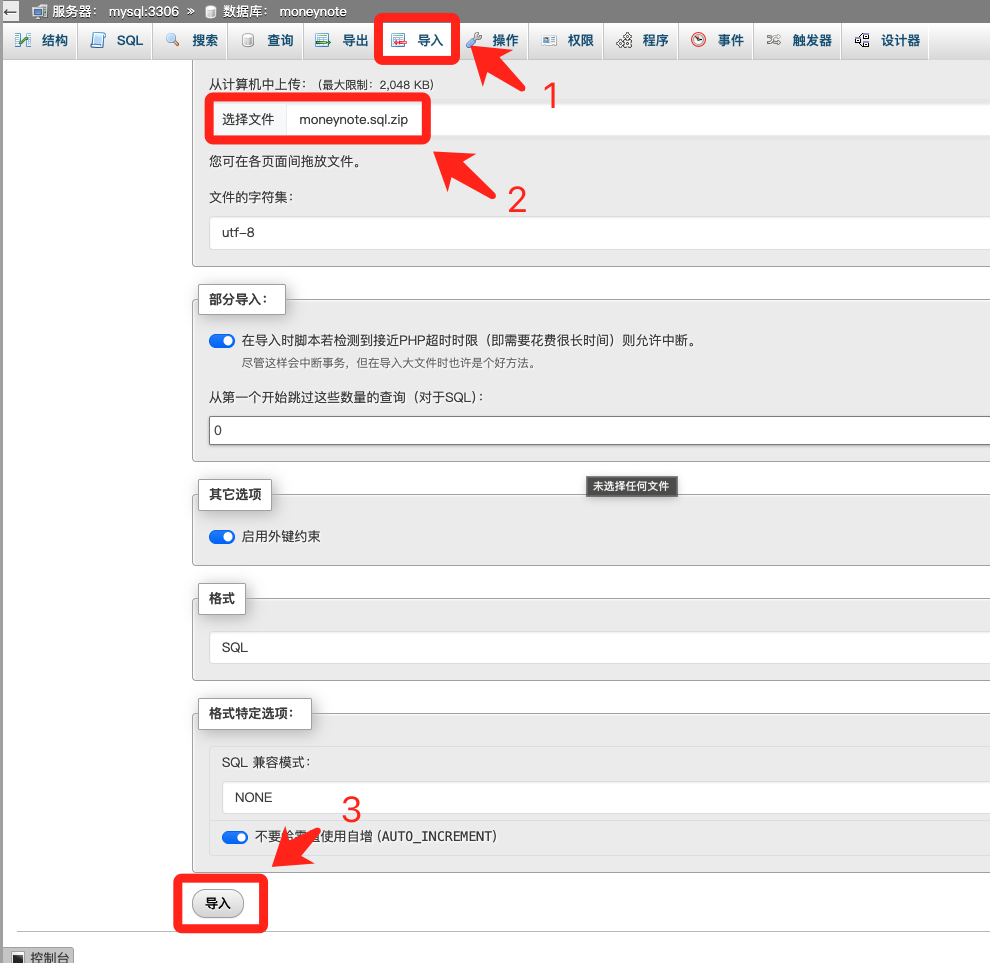

# 九块数据迁移好记

数据迁移流程

需要数据在同一个数据库实例上，所以需要先迁移九块记账到好记记账的数据库实例上（如果本身使用同一个实例则忽略）。

然后在九块记账中找到需要迁移的用户，在好记记账中注册被迁移的账号。

修改数据库脚本中的前5个参数（好记数据库、好记数据库、九块数据库、好记用户id、九块用户id）。

执行数据迁移脚本后登录好记网页版验证数据迁移结果

# 1、迁移九快记账数据到好记数据库实例上

自行选择熟悉的数据库工具，这里以phpmyadmin为例。

## 1.1、导出九快记账sql

登录九快记账数据库，导出对应数据库的sql。


导出示例：


## 1.2、确认sql中是否有创建moneynote的命令

首先查看导出的sql有没有create database命令，如果没有，则需要在脚本最见前增加以下sql：

```sql
CREATE DATABASE IF NOT EXISTS moneynote CHARACTER SET utf8mb4 COLLATE utf8mb4_unicode_ci;
USE moneynote;
```


然后保存sql脚本，并使用数据库工具连接好记的数据库实例，并执行这个脚本，这里依然以phpmyadmin为例：

注：phpmyadmin执行sql脚本限制文件大小，很多人有存储照片等，文件大小无法限制到2M以内，需要使用自己的数据库工具，例如：navicat、DataGrip等。



当数据库脚本执行完后，数据就迁移到好记数据库中了。

# 2、查询用户id

## 2.1、查询九快用户id

首先，在九块分组管理页面，打开开发者工具，点击network（网络）标签页。

具体步骤如下图所示：


然后点击用户列表 -> 开发者工具中的users -> Response（响应） -> 找到你的账号（username）对应的id -> 记住它后面用


## 2.2、查询好记用户id

以超级管理员账号登录你的好记管理系统，依次点击：系统管理 -> 用户管理。

找到你要迁移的用户，记住用户编号，后面用。


# 3、迁移九快记账数据到好记

## 3.1、下载脚本

迁移脚本地址：

```url
https://github.com/shuaichi/docker-compose-ali/blob/main/9%E5%BF%AB%E6%95%B0%E6%8D%AE%E8%BF%81%E7%A7%BB%E8%87%B3%E5%A5%BD%E8%AE%B0.sql
```

## 3.2、修改脚本


修改框中的数据：

use 好记数据库

SET @new_schema = '好记数据库'

SET @old_schema = '九快数据库'

SET @new_user_id = 好记用户id（2.2中的id）

SET @old_user_id = 九块用户id（2.1中的id）

## 3.3、执行数据库脚本

以phpmyadmin为例，点击SQL -> 复制脚本到查询框 -> 点击执行


## 3.4、验证结果

当首页有数据时，证明数据迁移成功。


# 4、注意事项

## 4.1、多用户记账数据迁移

迁移1个用户即可，然后在分组管理中添加对应的用户。

## 4.2、moneynote数据脚本执行失败

moneynote脚本存在外键，现在mysql最佳实践不需要外键，需要删除脚本中的外键相关sql，具体如下所示：


删掉CONSTRAINT开头见建表语句中的行。

注意，建表字段最后一行末尾没有逗号，删掉这两行外键后，上面KEY那行末尾的逗号也要删掉。
