# 群晖部署文档

# 1、所需群晖套件

1、Container Manager

2、MariaDB 创建时会数据密码和端口，需要记住，后面用。

3、PhpMyAdmin

4、Redis

# 2、数据库

登录 PhpMyAdmin，账号输入 root 密码输入 1.2 中的密码，点击登录。

## 1、创建数据库

点击左上角 SQL 标签。

​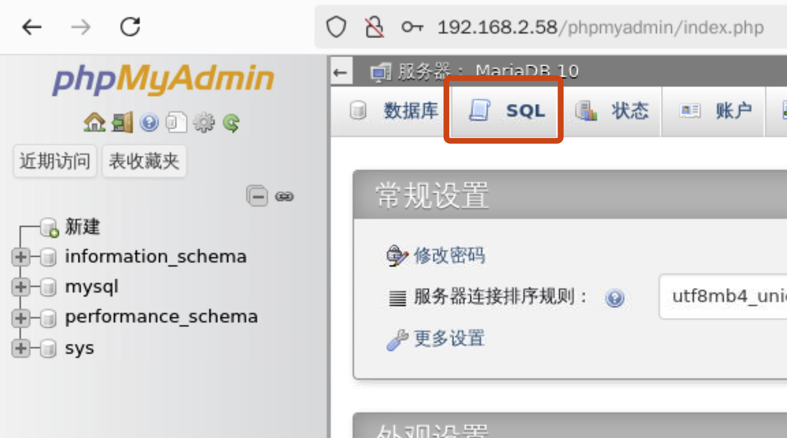​

输入如下 SQL 语句，点击执行：

```sql
CREATE DATABASE IF NOT EXISTS fortune_boot CHARACTER SET utf8mb4 COLLATE utf8mb4_unicode_ci;
```

​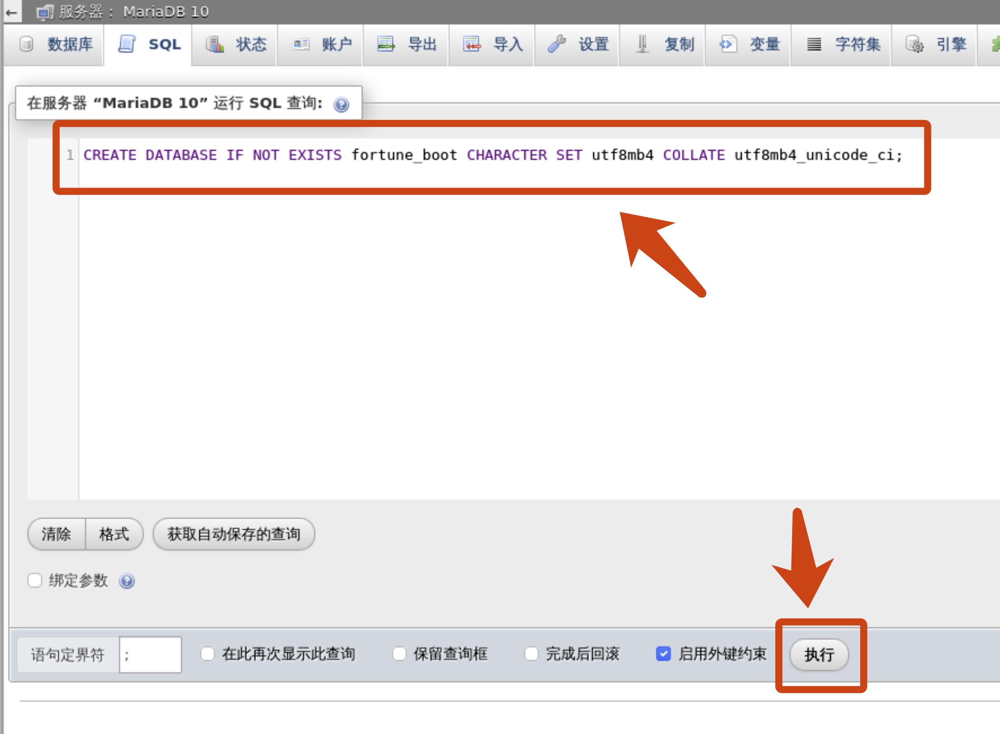​

执行成功后显示如下所示：  
​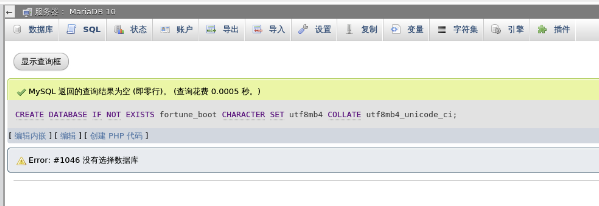​

## 2、初始化数据

再次点击 SQL 标签，输入如下 SQL：

```sql
# 使用fortune_boot数据库
use fortune_boot;
# 执行 sql
# https://github.com/shuaichi/FortuneBoot-Server/blob/master/sql/fortune-all-20250306.sql
```

​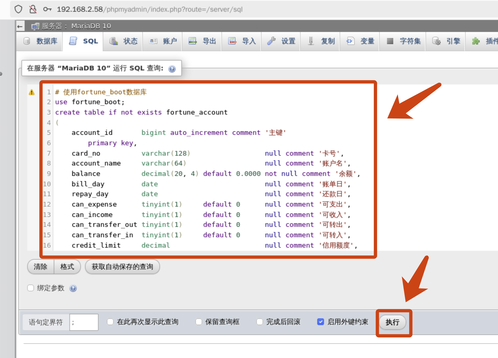​

## 3、创建账户

由于默认 root 账户只支持 localhost 登录，不支持远程登录，而且账户权限太大了，所以要创建一个小权限的账户供软件使用。

再次点击SQL 标签页，输入如下 SQL，并把如下 sql 中的'账号',‘密码‘替换为你的密码，并且密码要求大写、小写、数字、特殊字符、十位以上。

```sql
CREATE USER '账号'@'%' IDENTIFIED BY '密码';
GRANT SELECT, INSERT, UPDATE, DELETE ON fortune_boot.* TO '账号'@'%';
FLUSH PRIVILEGES;
```

​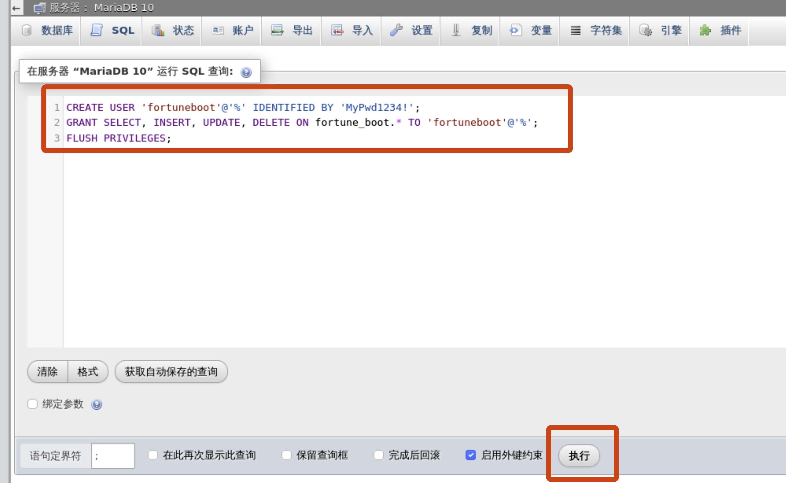​

## 4、打开启用 TCP/IP 连接

套件中心搜索 MariaDB -> 点击打开 -> 勾选启用 TCP/IP 连接 -> 点击应用。

​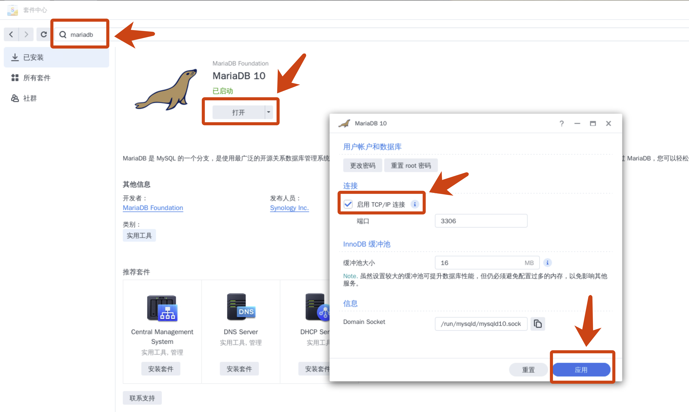​

# 3、修改 redis 配置

在套件中心搜索 redis -> 点击打开 -> 注释第 87 行（最前面加井号），增加第 88 行内容 -> 第 111 行的 yes 改为 no -> 记住第 1036 行的后半部分，这个是 redis 的密码 -> 点击保存 -> 重启 redis （停用后再启用 redis）

‍

​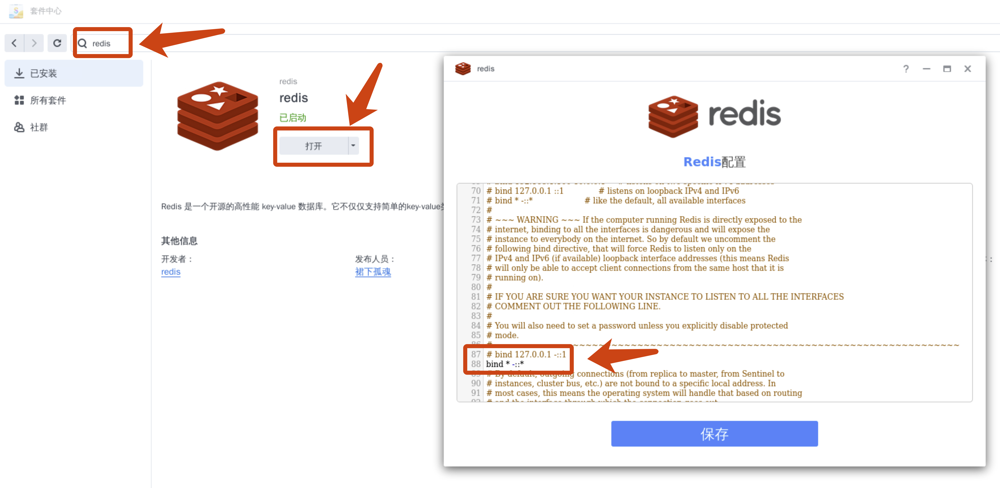​

​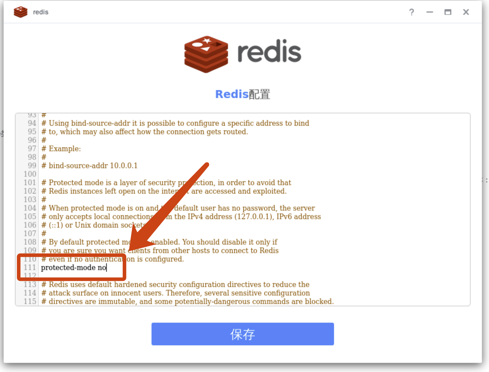​

​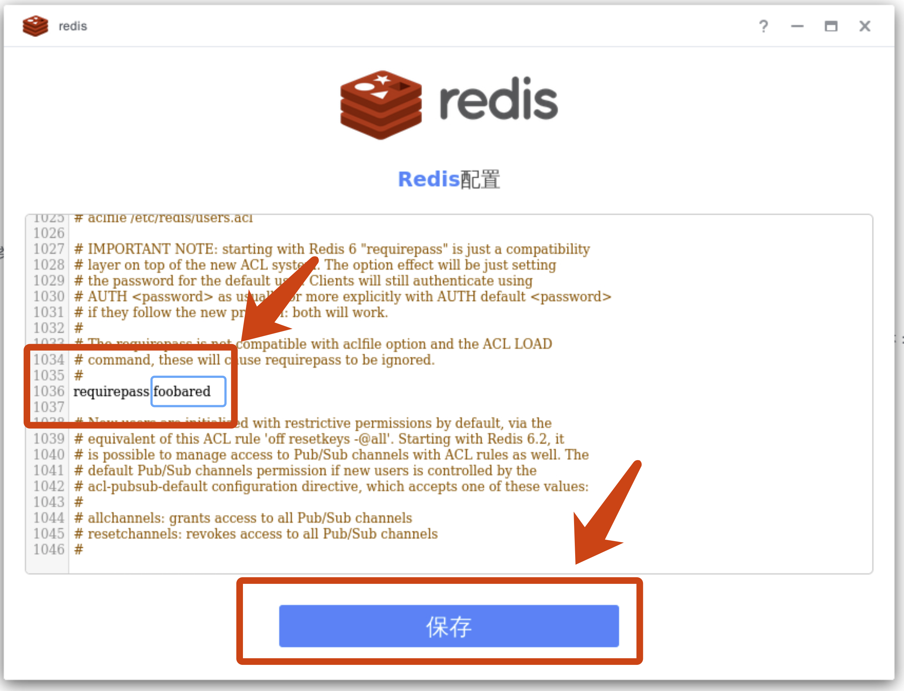​

# 4、部署好记记账

## 1、新建项目

打开 Container Manager -> 点击项目 -> 点击新增

​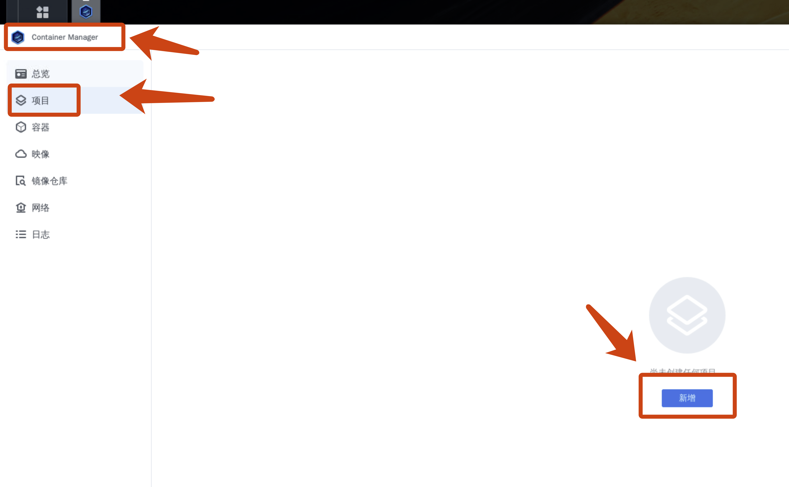​

## 2、拷贝 YAML 配置文件

输入项目名称- > 设置路径 -> 拷贝如下地址中的 yaml 到文件中 -> 替换数据库地址（群晖 ip）、端口（2.4 中设置）、数据库名 （2.1中设置）、账号/密码（2.3 中设置）、redis 地址（群晖 ip）、端口（未修改过的话是 6379）、密码（3 中查看）、建议替换 RSA 公钥/私钥 -> 点击下一步 -> 再点击下一步 -> 点击完成。

```url
https://github.com/shuaichi/docker-compose-ali/blob/main/docker-compose-only-app.yaml
```

​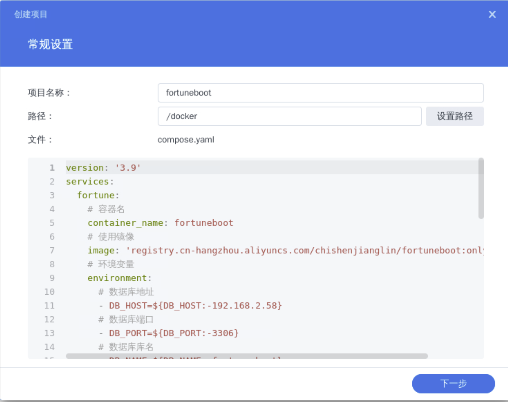​

## 2、等待镜像下载部署

根据网络状况不同，等待时间不同，显示如下内容表示部署成功。

​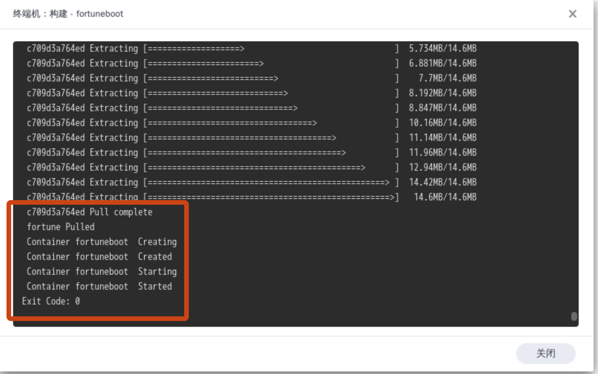​

## 3、查看容器启动结果

等待一会儿，根据配置不同等待时间不同，预计 1-3 分钟，日志显示如下内容表示容器启动成功。

​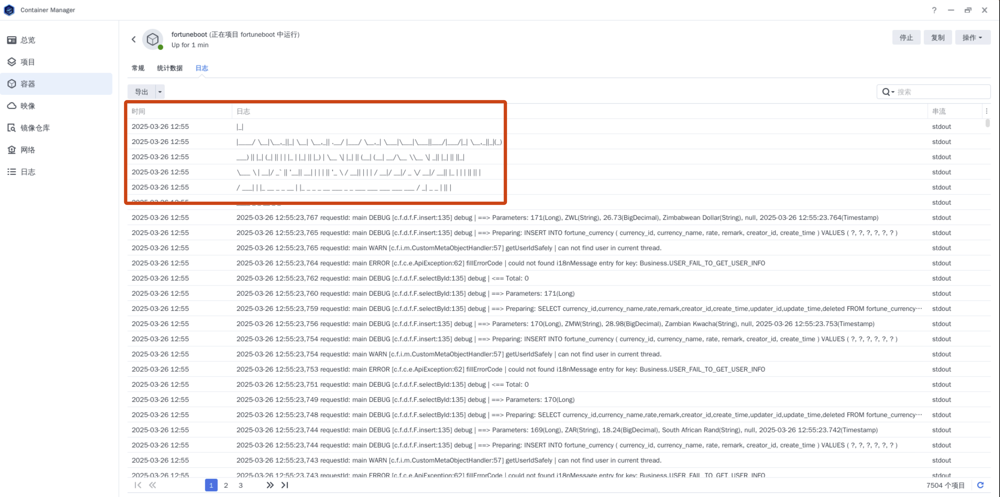​

# 5、尝试访问

浏览器地址栏输入 ip:46081 点击回车，如果验证码和底部api-version 版本号能加载出来，即表示部署成功，使用超管账号（admin/admin123）登录。

​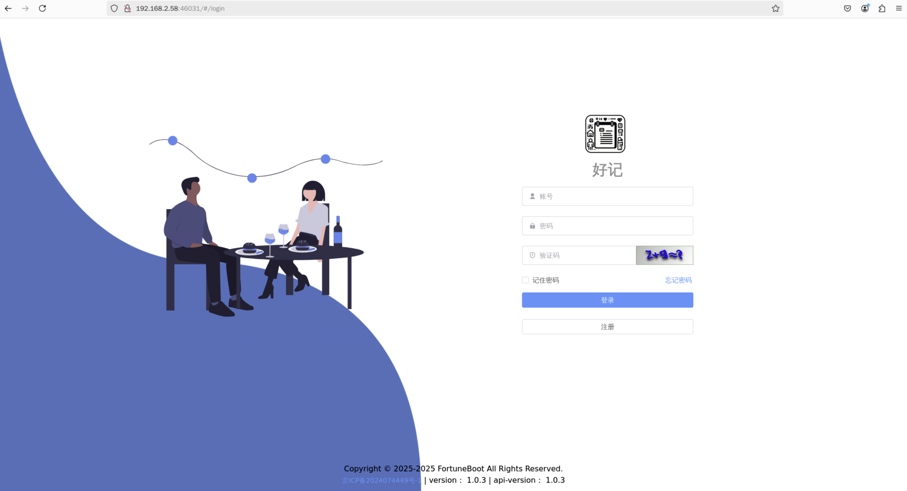​

# 6、Q&A

## 1、数据库配置错误

日志报错包含如下内容，表示数据库配置有误，请检查第二部分和第四部分中的 YAML 中的数据库地址、端口、库名、账号、密码。

```log
2025-03-26 14:27:19,464 requestId: main ERROR [c.a.d.p.DruidDataSource:940] init | init datasource error, url: jdbc:mysql://192.168.2.58:3306/fortune_boot?useUnicode=true&characterEncoding=utf8&zeroDateTimeBehavior=convertToNull&rewriteBatchedStatements=true&useSSL=true&serverTimezone=GMT%2B8 
```

​​

## 2、redis 配置错误

访问好记页面时报错"系统内部错误：redis 限流器异常，请确保 redis 启动正常"，验证码无法正常加载，但 api-version 版本号能正常加载，则是 redis 配置有误，请检查第三部分和第四部分 YAML 中的redis 地址、端口、密码。

​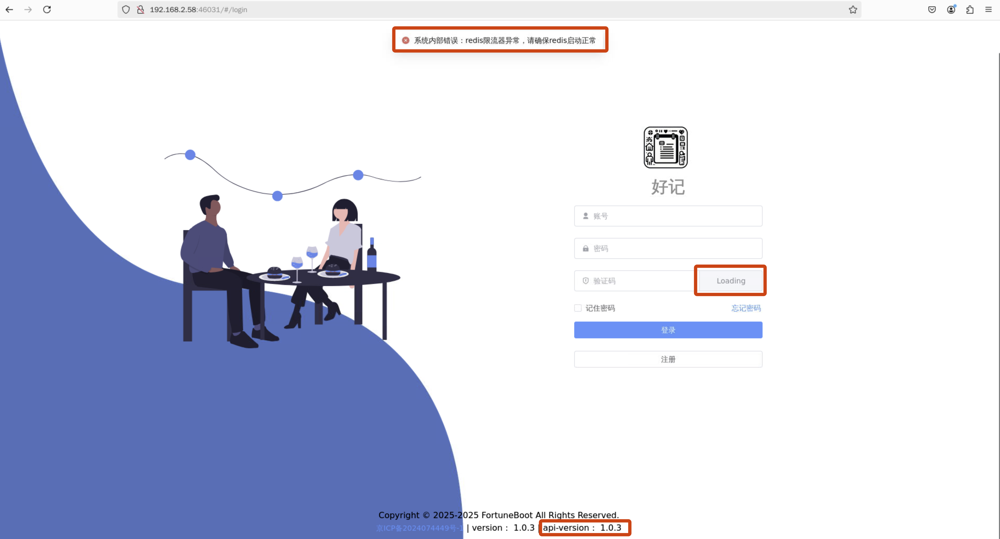​
